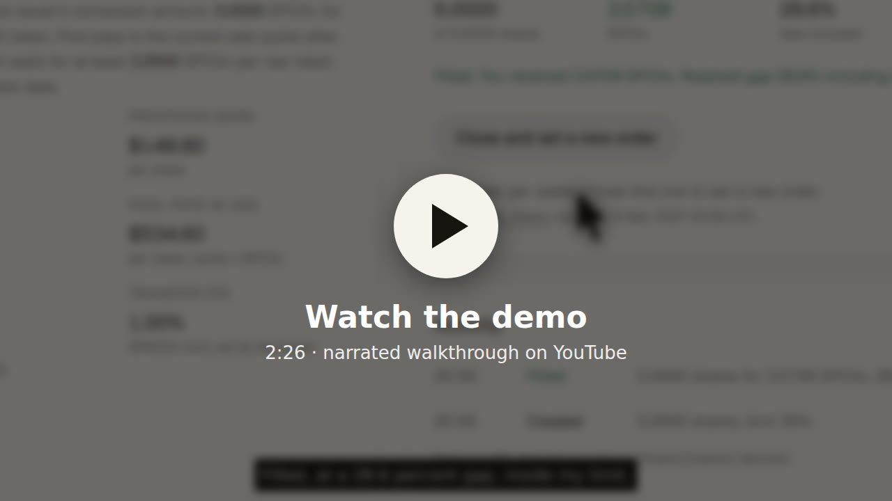
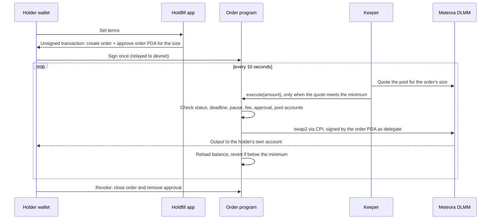
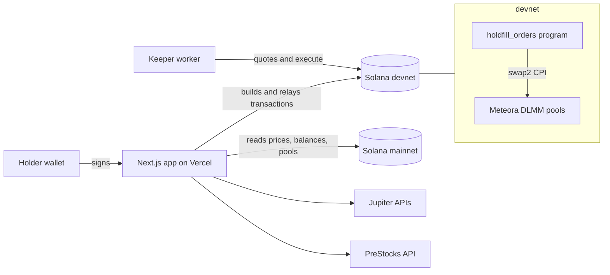

# Holdfill

**Hold through the lockup. Fill before the deadline.**

[](https://github.com/mystiquemide/holdfill/actions/workflows/ci.yml)
[](LICENSE)
[](https://holdfill.midelabs.xyz)
[](https://x.com/holdfill_xyz)
[](https://explorer.solana.com/address/A6UhawZdBQiMwpDYzFXKzTJD5voF29rLmrViUT6WaSGV?cluster=devnet)
[](https://hackathons.solana.com/hackathons/stocklana)


Holdfill gives PreStocks holders standing orders on Solana. A holder sets their terms once: the least they will accept, a fallback for the final weeks, and a hard stop at the issuer's deadline. Tokens stay in the holder's wallet until the market meets those terms, then an on-chain program sells through Meteora and checks that the holder received at least their minimum.

[Live app](https://holdfill.midelabs.xyz) · [Order app](https://holdfill.midelabs.xyz/app) · [Wallet-free demo](https://holdfill.midelabs.xyz/demo) · [Proof](https://holdfill.midelabs.xyz/proof) · [Markets](https://holdfill.midelabs.xyz/markets) · [Docs](https://holdfill.midelabs.xyz/docs) · [Launch thread on X](https://x.com/holdfill_xyz/status/2103030916461334858)

Built for [Stocklana](https://hackathons.solana.com/hackathons/stocklana): main track and the PreStocks bounty. Orders execute on Solana devnet against replicas of the real tokens; market data is live mainnet.

[](https://youtu.be/D0putYI1KXs)

---

## Contents

- [The problem](#the-problem)
- [The solution](#the-solution)
- [Try it in two minutes](#try-it-in-two-minutes)
- [Why Solana](#why-solana)
- [How it works](#how-it-works)
- [Integrations](#integrations)
- [Architecture](#architecture)
- [Security model](#security-model)
- [Evidence and proof](#evidence-and-proof)
- [Tests](#tests)
- [Run it locally](#run-it-locally)
- [Open-source components](#open-source-components)
- [Limits](#limits)
- [Roadmap](#roadmap)

---

## The problem

PreStocks are tokenized pre-IPO shares. When the company lists, holders must convert before a deadline the issuer sets, or the tokens expire. SpaceX was the first:

> "SpaceX PreStocks tokens must be swapped into $SPCXx or any other token before 11:59pm UTC on 12 March 2027, or they will expire worthless." ([prestocks.com/spacex](https://www.prestocks.com/spacex))

Conversion happens through normal trading, so the price a holder gets depends on the day they sell. On chain, that price has been well below what the tokens convert into:

| Measured on mainnet | Value | Source |
|---|---|---|
| SpaceX PreStocks holders | 10,043 wallets | Jupiter Tokens API, 23 Sep 2026 |
| Pool payout vs the issuer's conversion amount | 29.8% under, fees included | Live Meteora quote, 23 Sep 2026 |
| Daily gap since listing | 14.0% to 38.9% | 71 daily closes, [data/haircut-history.json](data/haircut-history.json) |
| Monthly average gap | June 32.8%, July 27.9%, August 23.9%, September 23.4% | same |
| One real sale | 2,419.9 shares sold in 171 swaps on 12 July for 1,543.0 SPCXx, 36.24% under | [data/case-study.json](data/case-study.json) |
| That day vs later | The daily gap first fell to 20% on 4 August, 23 days later | same |
| XAI, the previous deadline | 1,473 wallets still held 2,078.5 XAI after its 12 September deadline passed | on-chain count, same file |

The gap narrows as lockups end, but unevenly. A holder who wants a fair price has to watch the pool every day for months, and a holder who forgets loses everything at the deadline.

The usual answer is a limit order. None exists for these tokens: every PreStocks mint carries a 1% Token-2022 transfer fee, and Jupiter's Trigger API (V1, tested live) refuses mints with a transfer fee. Holdfill checks this live for all eight PreStocks markets on the [markets page](https://holdfill.midelabs.xyz/markets): 8 of 8 refused, "Mint ... has transfer fee".

Across all eight markets, about 109,000 holder accounts hold roughly $22 million at the PreStocks mark (live figures on the markets page).

## The solution

Holdfill is a non-custodial standing order for PreStocks, with three order types in one Solana program:

| Order type | For | The holder sets | The program guarantees |
|---|---|---|---|
| Conversion | SpaceX PreStocks today | Largest gap accepted, fallback date, fallback floor | Output of at least entitlement x (1 - limit), then at least the floor from the fallback date, and nothing after the issuer deadline |
| Price order | Any PreStocks token, into USDC | Least USDC per token, expiry | Output of at least the holder's price, on a pool the program has checked trades exactly that pair |
| Arm for the IPO | Tokens whose issuer has not named a successor (Anthropic, OpenAI) | Largest gap from the future entitlement, fallback days before the future deadline, floor | Nothing sells until the issuer registers the event; then the holder's own terms apply |

What stays true for every order:

- Tokens never leave the holder's wallet until a fill. The holder approves the order account as a delegate for the order size only.
- Revoke is one transaction and takes effect at once.
- Fills are permissionless. The keeper is a convenience; anyone can call `execute`, because the program, not the caller, enforces the terms.
- The program stops a fill if the issuer pauses the token or changes the transfer fee after the holder signed.

For issuers, the [issuer view](https://holdfill.midelabs.xyz/issuer) shows how many holders have orders, how much those orders cover with a live approval, and what already converted, next to each market's holder count and deadline.

## Try it in two minutes

1. Open the [order app](https://holdfill.midelabs.xyz/app) and connect Phantom, Solflare, or Backpack. The wallet only signs; Holdfill relays to devnet, so its network setting doesn't matter.
2. Press "Get replica SPACEX". The faucet sends 1 replica token (5 shares) and a little devnet SOL.
3. Set the largest gap you accept (the pool currently pays about 29% under, so a 35% limit fills), sign once, and watch the order card. The keeper checks every 10 seconds, or press Check now.
4. Switch to Anthropic or OpenAI to place a price order into USDC, or arm an order for a future IPO.
5. Revoke or close any order from its card.

No wallet? The [demo page](https://holdfill.midelabs.xyz/demo) walks through recorded devnet transactions for every path, each linked to Solana Explorer.

## Why Solana

- **Token-2022 rules are readable on chain.** The PreStocks transfer fee and pause switch live in the mint account. The program reads them on every fill and refuses when they changed, which no off-chain limit order can promise.
- **Delegate approvals make it non-custodial.** An SPL approval lets the order account move exactly the approved amount and nothing more, so there is no vault, escrow, or pooled balance.
- **Composable liquidity.** The program calls Meteora DLMM's `swap2` directly through CPI and signs as the holder's delegate, then measures the holder's own balance change.
- **Cost and speed.** Checking every open order every 10 seconds, and filling in parts as liquidity appears, only makes sense with sub-cent fees and fast confirmation.
- **The tokens are here.** PreStocks, xStocks, and their liquidity are Solana assets.

## How it works



For armed orders, the issuer's lifecycle event (successor token, conversion amount, pool, deadline) is written on chain by the event admin. On its next tick after that, the keeper calls the permissionless `activate`, which copies the event's terms into the order while keeping the holder's limit, floor, and size. The keeper also creates the holder's account for the successor token if it doesn't exist.

The minimum is computed only from stored terms:

```
haircut  = now < fallback_ts ? limit_bps : 10000 - fallback_floor_bps
required = ceil(amount_in x ratio_num x (10000 - haircut) / (ratio_den x 10000))   (u128, one division, rounds up)
```

A price order stores the holder's price as the ratio with a 0% limit, so the same check covers every order type.

## Integrations

| Service | How Holdfill uses it |
|---|---|
| [Solana](https://solana.com) | The order program (Anchor 1.2) on devnet. Token-2022 mint extensions, SPL delegate approvals, PDAs. |
| [PreStocks](https://www.prestocks.com) | The tokens holders convert or sell. The PreStocks API supplies mark prices and supply for all eight markets; issuer terms are quoted from the PreStocks pages. Only PreStocks pre-IPO tokens are used. |
| [Meteora](https://www.meteora.ag) | Every fill is a DLMM `swap2`, called through CPI. The DLMM TypeScript SDK builds quotes and swap accounts; devnet replica markets are DLMM pools priced from the mainnet pools. |
| [Jupiter](https://jup.ag) | Price API v3 and Tokens API v2 for prices, holder counts, and volume. A live Trigger API V1 request per market shows it refuses PreStocks mints. |
| [Helius](https://www.helius.dev) | RPC for mainnet reads and devnet orders, with a separate key for the keeper. |
| [xStocks](https://xstocks.fi) | SPCXx, the listed SpaceX token that SpaceX PreStocks convert into. |
| [GeckoTerminal](https://www.geckoterminal.com) | Daily closes for the gap history and the backtest. |
| [Vercel](https://vercel.com) | Hosts the web app and API routes. |

## Architecture



| Part | Path | Role |
|---|---|---|
| Order program | [programs/holdfill_orders](programs/holdfill_orders) | Anchor program: `register_event`, `create_order`, `create_price_order`, `arm_order`, `activate`, `execute`, `cancel_order` |
| Keeper | [keeper/](keeper) | Scans open orders, sizes the largest fill that meets the minimum (binary search over quotes), activates armed orders, sends `execute`. Holds no tokens. |
| Web app | [web/](web) | Next.js 16 app and API routes: live market data, order tickets, faucet, transaction builders, relay, issuer view |
| Scripts | [scripts/](scripts) | Devnet market setup, proof recorders, fork proof, data refresh |
| Tests | [tests/](tests) | Local-validator program suite |
| Config and data | [config/devnet.json](config/devnet.json), [data/](data) | Every devnet address; proof records and market history |

Accounts:

- `LifecycleEvent`, PDA `["event", input_mint]`: issuer terms (successor mint, pool, conversion ratio, deadline). Written once by the event admin.
- `Order`, PDA `["order", owner, input_mint]`: the holder's terms, size, fills, and status (Active, Filled, Armed). One order per wallet per token, because a token account can approve only one delegate.

[docs/ARCHITECTURE.md](docs/ARCHITECTURE.md) documents every instruction, check, error, event, API route, and the threat model in full.

## Security model

The program checks, on every fill:

- the order is active, the deadline or expiry has not passed, and the amount fits the remaining size
- the token is not paused, and the transfer fee equals the fee the holder signed with
- the pool is the order's pool; reserves, oracle, bitmap, and event authority are PDAs the program derives itself
- the input token program is Token-2022, and the output token program owns the output mint
- no host fee account is passed
- input and output accounts are the holder's own associated token accounts, and the order account is the approved delegate for enough
- after the swap, the holder's output balance rose by at least the minimum

A price order is created only on a Meteora DLMM account whose token X and token Y are exactly the input and output mints, and it can't outlive an existing issuer deadline.

Off chain: the server builds unsigned transactions and relays only holder-signed transactions that touch Holdfill, token, and system programs. Routes that call RPC have per-client limits. The faucet has per-wallet and global caps and keeps a SOL reserve. Keys live only in server environment variables.

The program is unaudited and deployed only on devnet. Accepted risks are listed in the [threat model](docs/ARCHITECTURE.md#10-security-review-threat-model).

## Evidence and proof

**On devnet**, every path is recorded and opens on Solana Explorer. The raw results are in [data/proof-devnet.json](data/proof-devnet.json) and [data/proof-devnet-v2.json](data/proof-devnet-v2.json).

**Convert before the deadline (SpaceX)**

| Step | Result | Transaction |
|---|---|---|
| Register the SpaceX conversion event (5 SPCXx per token, deadline 12 Mar 2027) | confirmed | [4gNM…DNdh](https://explorer.solana.com/tx/4gNMtLdECtwWmckVuHULLfQh3DtDzmJ1V2aCR4S6eGBNCAWGoyKxU6Pn7DQEoSCMoHEYVBzUkDgQ1khY1KmXDNdh?cluster=devnet) |
| Create a conversion order: 2.5 shares, 35% limit, 50% fallback floor | confirmed | [3R1A…wn53](https://explorer.solana.com/tx/3R1ABTPLUMcH7rHKrBRMPDZysPzdNyP68DN7MrQcRTPyzkoRxoMG6EBkCU3vuWtDTXF55c9GND568SC68UjFwn53?cluster=devnet) |
| Keeper fills 0.1 raw SPACEX: 0.354 SPCXx received against a 0.325 minimum (29.2% gap) | confirmed | [4Bs8…HwZc](https://explorer.solana.com/tx/4Bs8GmHNn36FhRb2eoU9mZdkphbJcoELvuywNryocfWQE2Eqdbr3NMT9a4zEqo4g887NuwEPXo8byBdjTsaxHwZc?cluster=devnet) |
| Fill at a 10% limit when the pool pays less | refused on chain | [hyxF…aefm](https://explorer.solana.com/tx/hyxFFgMh2sTddEKJkth8gfaCrBCvaFrczxC9XPtmW75dFMjyEzXNFuBHCethxXcMhyUtpL5EHpygfLRBu41aefm?cluster=devnet) |
| Holder revokes: order closed and approval removed in one transaction | confirmed | [36Xn…bKeU](https://explorer.solana.com/tx/36XnRwGqZpFubBmU5u8NdV8ghJwft7JqwdGy5uVi2sz2CYXydMK9R6Aor7z28RHUpLmKyyfvxKtTVm3p1r9xbKeU?cluster=devnet) |
| Keeper fill after the revoke | refused on chain | [24U4…Kj9j](https://explorer.solana.com/tx/24U4ySTnS8qnAPngPVp4JbJdMDkVpwfQ4xcrHb7M6qR6aQ3oUxBhArdKLFKUnmFL6GW8mdH7KehwwNW1dCG4Kj9j?cluster=devnet) |

**Sell at your price (Anthropic, into USDC)**

| Step | Result | Transaction |
|---|---|---|
| Create a price order: 0.3 ANTHROPIC at 800 USDC per token or better | confirmed | [3tWU…guak](https://explorer.solana.com/tx/3tWUhvQLptafdohGbGmSoXXwbBZ83N8Q7bPeLP5kpaDvRGN1dsaWxMeLsWCtXgTRBSn3i3zqzrMUVGw3kJBHguak?cluster=devnet) |
| Keeper fills at 926.42 USDC per token | confirmed | [53Gq…6KFZ](https://explorer.solana.com/tx/53GqLikCoQ26iWCAqtviuCtbxxj9WceeLFGwmFU4yenD6NuvBBfQz6H9ynZYtvQ3gBAjLxYYVRVZfuTFDJwQ6KFZ?cluster=devnet) |
| Price order at 2,000 USDC when the pool pays about 930 | refused on chain | [5vmj…S6o2](https://explorer.solana.com/tx/5vmjWHk3PxRtdUeTeT1b8nMHe1F7XYMuFbw9zBfM3R7NCv7zHvifgwbBvTzmks48wnbcN7bxLDgMfAkNFUvbS6o2?cluster=devnet) |

**Arm for the IPO**

| Step | Result | Transaction |
|---|---|---|
| Arm an order on a demo token before any issuer event (30% limit) | confirmed | [2dxa…tmkY](https://explorer.solana.com/tx/2dxabxXe1hzPYBKQoV4T88UeNS1bqFaGsiGk1XtVrppDAARgJPZnuoR7LPaH1ftYpjBd4j5iKuaGPsxq5QwhtmkY?cluster=devnet) |
| Simulated issuer event for the demo token (labeled, devnet only) | confirmed | [3nwF…fRB2](https://explorer.solana.com/tx/3nwF4nTLGDw55f7NEUYSsbCKRdhxHHMNipxFiDEVSoBzfCp72HNBXjfz9sdMmRESvGXix1LyeG2tS1F63nuCfRB2?cluster=devnet) |
| Keeper activates the order with the event's terms | confirmed | [24Bt…F4EX](https://explorer.solana.com/tx/24BtEY5JzbTyTy6UaCnsZmWizBXG6taswpt9mjTeNc72ZKyY5sRsbjhwgXXGKhUum7qQie6giJRD24LmEdSMF4EX?cluster=devnet) |
| Keeper fills 24.4% under entitlement, inside the 30% limit | confirmed | [5MA8…hNqk](https://explorer.solana.com/tx/5MA8hpcmLuJHcEKK1RXTDo2JLa2pcwQX66qcYUKUADdZmadZEciM2EEjqFbtC9UQpiUmKuhCk46kmcABAYPWhNqk?cluster=devnet) |

The demo token and its issuer event are simulated and labeled as such; no real issuer announced them.

**Devnet accounts**

| Account | Address |
|---|---|
| Order program | [`A6Uh…aSGV`](https://explorer.solana.com/address/A6UhawZdBQiMwpDYzFXKzTJD5voF29rLmrViUT6WaSGV?cluster=devnet) |
| SpaceX lifecycle event | [`GZ1k…MUsQ`](https://explorer.solana.com/address/GZ1kZNmd9CDb8LgUTDRrpVbBnHADP1pWa5r3ub1vMUsQ?cluster=devnet) |
| Replica SPACEX / SPCXx pool | [`5XhZ…jLzM`](https://explorer.solana.com/address/5XhZb6WKSu5cDMwGCV7qv7DTLPqcYMRnjZkeXn9fjLzM?cluster=devnet) |
| Replica ANTHROPIC / USDC pool | [`BtUc…qYhr`](https://explorer.solana.com/address/BtUcU2wWJo9EXXcJcGFJ8UmcJztCdRCjUZT9CrXbqYhr?cluster=devnet) |
| Replica OPENAI / USDC pool | [`Gv78…gbPF`](https://explorer.solana.com/address/Gv78piK6JkMvsktQ7yjiKiobhZYSck5nKLANPzpvgbPF?cluster=devnet) |
| Replica SPACEX mint | [`5cY1…Ghsu`](https://explorer.solana.com/address/5cY1jzmozhRjZTQiCmNSUekcv8pnFV672L9Cm53TGhsu?cluster=devnet) |
| Replica SPCXx mint | [`4gG3…HitZ`](https://explorer.solana.com/address/4gG3VgCCugr3rG2emLp1VRsZweTwhbirXEEfp1FWHitZ?cluster=devnet) |
| Replica ANTHROPIC mint | [`GNYx…oC2g`](https://explorer.solana.com/address/GNYxLkRru8ywfA13kPTf3ZSitkd5fy3QYF6mGueLoC2g?cluster=devnet) |
| Replica OPENAI mint | [`D5nC…P4tX`](https://explorer.solana.com/address/D5nC7RBFxBMH8A47pr5MEMh4ASfpe3wtZM42rkLBP4tX?cluster=devnet) |
| Replica USDC mint | [`BD2B…c88i`](https://explorer.solana.com/address/BD2BV4vyLJNJzgkA7DPNwdCB6CLG6W231JtCPWaXc88i?cluster=devnet) |

**On cloned mainnet state**, `npm run proof:fork` runs the same program binary as the devnet deployment against the real mints and pools, 7 of 7 passing ([data/proof-fork.json](data/proof-fork.json)):

| Check | Result |
|---|---|
| Fill at the holder's price on the real SPACEX/SPCXx pool | 0.1 raw SPACEX filled 29.8% under entitlement; the real 1% fee withheld exactly |
| Issuer pause | refused with `MintPaused` |
| Holder revokes | refused with `DelegateMismatch` |
| Price below the holder's minimum | refused on chain |
| Issuer raises the transfer fee | refused with `FeeChanged` |
| Price order on the real OpenAI/USDC pool | 0.05 OpenAI sold for 96.33 USDC against an 86.65 minimum |
| Price above what the pool pays | refused on chain |

## Tests

| Suite | Command | Result | Who can run it |
|---|---|---|---|
| Order math (Rust) | `npm run test:program` | 9 of 9 | anyone |
| Keeper math matches the program | `npm run test:keeper-math` | 7 of 7 | anyone |
| Backtest | `npm run test:backtest` | 6 of 6 | anyone |
| Property tests: 8 on the program math, 4 on keeper fill sizing, 10,000 random cases each, plus 20,000 vectors replayed from Rust through the keeper | `npm run test:props` | 14 of 14 | anyone |
| Fork proof on cloned mainnet state | `npm run proof:fork` | 7 of 7 | anyone with a Helius key and the toolchain |
| Program suite on a local validator cloned from the devnet markets | `npm run test:local` | 40 of 40 ([result](data/program-local.json)) | maintainers: it registers lifecycle events, which needs the event admin key |

The property tests check that every minimum is the exact ceiling of the holder's terms (never below, never a unit above), that minimums grow with size and never shrink when a fill is split, that price orders never discount, that the fallback schedule stays in bounds, and that every fill the keeper picks meets the minimum and is the largest size that does. Planting a rounding bug in either the program or the keeper makes them fail.

The program suite covers fills, partial fills, the fallback floor, the deadline, fee changes, substituted token programs, host fees, wrong reserves and output accounts, overfills, revoke, price orders into classic-token USDC, pools that trade another pair, expiry, arming, activation before and after an event, and the keeper's own paths.

## Run it locally

Requirements: Node 22 or later, and a free [Helius](https://www.helius.dev) API key. The program toolchain is needed only for the tests and proofs: Rust 1.89 (pinned in `rust-toolchain.toml`), Anchor 1.2, and the Solana CLI 4.x with `solana-test-validator`.

```bash
git clone https://github.com/mystiquemide/holdfill.git
cd holdfill
npm ci
```

Create `web/.env.local`:

```bash
HELIUS_API_KEY=your_helius_key
KEEPER_KEYPAIR=[...]          # any devnet keypair with a little SOL, as a JSON array; pays for "Check now" fills
KEEPER_TICK_SECRET=any-random-string
# FAUCET_KEYPAIR=[...]        # only the replica mint authority can run the faucet; see below
```

Make a keeper keypair with `solana-keygen new -o keeper.json --no-bip39-passphrase`, fund it at [faucet.solana.com](https://faucet.solana.com), and paste the file's contents as `KEEPER_KEYPAIR`.

Start the app at http://localhost:3000:

```bash
npm run dev:web
```

Your local app uses the same devnet program, replica tokens, and pools as the live app (addresses in `config/devnet.json`). The replica mints belong to the project's issuer key, so a local faucet can't mint: get replica tokens from the live app's faucet with your wallet, then set orders from your local app.

Run the keeper so orders fill without pressing Check now:

```bash
HELIUS_API_KEY=your_helius_key KEEPER_KEYPAIR_PATH=./keeper.json npm run keeper
```

Run the tests and the fork proof:

```bash
npm run test:program
npm run test:keeper-math
npm run test:backtest
npm run test:props
npm run build:program
HELIUS_API_KEY=your_helius_key npm run proof:fork
```

`proof:fork` starts and stops its own local validator on port 8999 and sends nothing to mainnet.

### Deploy your own

Change `declare_id!` in `programs/holdfill_orders/src/lib.rs` and `EVENT_ADMIN` in `programs/holdfill_orders/src/constants.rs` to your keys, then build and deploy the program to devnet. With `ISSUER_KEYPAIR_PATH` pointing at your issuer keypair, run `npm run devnet:setup` (replica SPACEX and SPCXx, and a DLMM pool at the mainnet price), `npm run devnet:proof` (registers the SPACEX lifecycle event and records proof transactions), and `npm run devnet:markets -- ANTHROPIC OPENAI` (replica USDC markets). Each script writes its addresses to `config/devnet.json`, which the app and keeper read.

## Open-source components

Holdfill is original work, built during the hackathon. It uses these open-source libraries: [Anchor](https://github.com/solana-foundation/anchor) and anchor-spl, [@solana/web3.js](https://www.npmjs.com/package/@solana/web3.js), [@solana/spl-token](https://www.npmjs.com/package/@solana/spl-token), [Meteora DLMM SDK](https://github.com/MeteoraAg/dlmm-sdk), [Solana Wallet Adapter](https://github.com/anza-xyz/wallet-adapter), [Next.js](https://github.com/vercel/next.js), [React](https://github.com/facebook/react), and [Tailwind CSS](https://github.com/tailwindlabs/tailwindcss). Photos are credited on the site.

## Limits

- Execution runs on devnet. Replica tokens keep the 1% transfer fee, but Meteora's devnet pools reject the pause, delegate, and scaled-amount extensions without an admin badge, so the fork proof covers the real mints.
- Devnet pools charge a 10% fee (the only devnet preset), so devnet fills pay less than mainnet quotes.
- The keeper fills only while it runs. If it stops, orders stay open and tokens stay in the wallet; anyone can still call `execute`, and the app's Check now runs one pass.
- The program is unaudited and upgradeable; the authority is the demo issuer key, shown live on the proof page.

## Roadmap

**Shipped during Stocklana**

- One order program with three order types: convert before the deadline, sell at your price into USDC, and arm for the IPO.
- Keeper on a 10-second loop with partial fills, plus a permissionless `execute` anyone can call.
- Live app on devnet with replica SpaceX, Anthropic, and OpenAI markets, a faucet, a wallet-free demo, a markets registry for all 8 PreStocks, and an issuer view.
- Fork proof on cloned mainnet state (7 of 7), a 40-case program suite, and property tests that keep the program and keeper math in lockstep.

**Next: mainnet**

- Independent security review of the order program.
- Mainnet deployment of the same program, with the upgrade authority moved to a multisig.
- Keeper on dedicated RPC with monitoring and alerting.

**Then: coverage**

- Lifecycle events for Anthropic, OpenAI, and the other PreStocks markets as issuers announce them, so armed orders activate on their own.
- Price orders on every PreStocks market with a USDC pool.
- Notifications when an order fills or its fallback window starts.

## Disclaimer

PreStocks give economic exposure, not ownership rights, and secondary-market liquidity isn't guaranteed. They are unavailable in the U.S. and to U.S. persons; see the [issuer's terms](https://prestocks.com/faq?tab=legal). Holdfill is not affiliated with SpaceX, PreStocks, xStocks, Meteora, Jupiter, or Helius. Nothing here is financial advice.

## License

[MIT](LICENSE)
