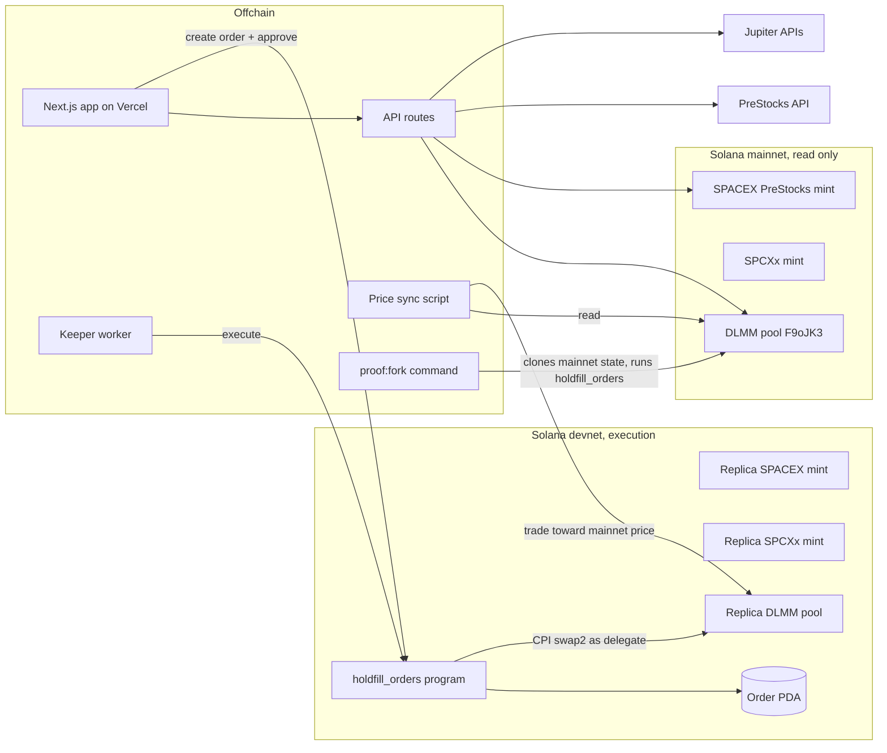

# Holdfill architecture

Version 1.0, 23 September 2026. Status: awaiting approval.

## 1. System overview

Two networks, one rule: mainnet is only read, devnet is where orders execute. Every screen labels which network a number comes from.

## 2. Components

| Component | Runtime | Responsibility |
|---|---|---|
| `programs/holdfill_orders` | Solana program, Anchor 1.2.0 | Stores order terms. Enforces limit, fallback, issuer deadline, size cap, fee and pause state. Executes the swap as delegate via CPI into Meteora DLMM `swap2`. |
| `web/` | Next.js 16.3.6, React 19.2, Tailwind v4, Vercel | App Router pages: `/` (introduction), `/app` (the order app), `/evidence`, `/proof`; `/order` redirects to `/app`. Wallet connect opens the app. The server builds order and revoke transactions; the wallet signs; the server relays to devnet. |
| `web/src/app/api/*` | Next.js route handlers (Node runtime) | Mainnet reads, history, backtest, faucet, keeper tick. Server-only keys. |
| `keeper/` | Node 22 worker, same code as the tick route | Polls active orders, quotes the pool, calls `execute` when the order's minimum is reachable. |
| `scripts/sync-devnet-price.ts` | Node 22 script, run on demand | Moves the devnet pool price to the live mainnet SPACEX/SPCXx price by trading issuer inventory. Run after setup, before recording, and before deploy. |
| `scripts/proof-fork.ts` (`npm run proof:fork`) | Node 22 + local validator | Clones mainnet (DLMM program, real SPACEX and SPCXx mints, real pool), loads `holdfill_orders` into the local validator, and runs five checks with the order PDA as delegate: a fill at the holder's price (real 1% fee withheld), issuer pause, revoke, below-minimum fill, and issuer fee change. Writes `data/proof-fork.json`. |
| `scripts/case-study.ts` | Node 22 script | Finds one real mainnet SPACEX sale on the pool at a deep haircut and the XAI holder count after expiry. Writes `data/case-study.json`. |
| `scripts/` | Node 22 | One-time devnet setup: replica mints, pool, liquidity. History snapshot refresh. |

## 3. Devnet replica environment

| Item | Value |
|---|---|
| Replica SPACEX | `5cY1jzmozhRjZTQiCmNSUekcv8pnFV672L9Cm53TGhsu`. Token-2022, 9 decimals, no freeze authority. Extensions: TransferFeeConfig (100 bps, max fee u64::MAX), MetadataPointer + TokenMetadata ("SpaceX PreStocks (devnet replica)", "SPACEX"). |
| Replica SPCXx | `4gG3VgCCugr3rG2emLp1VRsZweTwhbirXEEfp1FWHitZ`. Token-2022, 8 decimals, no freeze authority. Extensions: MetadataPointer + TokenMetadata ("SpaceX xStock (devnet replica)"). |
| Differences from mainnet (gate G1 result) | Meteora DLMM on devnet rejects ScaledUiAmount (`UnsupportedMintExtension`, 6070) and PermanentDelegate, Pausable, or a freeze authority (`UnsupportedTokenMint`, 6073) without an admin token badge, which mainnet SPACEX has. Reproduced by `scripts/probe-dlmm-extensions.ts`. The replicas keep the 1% transfer fee. The app applies the issuer-stated 5x split for display. The order program treats a missing PausableConfig as not paused. The fork proof runs against the real mint with every extension. |
| Authority | Issuer keypair `12fN9mtc7x93AyTCpwzLUDPdu2k5h5YswfNigayAYzDg` (throwaway, stored outside the repo). |
| Pool | Meteora DLMM program `LBUZKhRxPF3XUpBCjp4YzTKgLccjZhTSDM9YuVaPwxo` on devnet, `initialize_lb_pair2` with a v2 preset parameter. Devnet only has bin step 10 presets (checked 23 Sep: 4 presets, all bin step 10); the mainnet pool uses bin step 100. tokenX = replica SPACEX, tokenY = replica SPCXx, initial active bin = live mainnet active price at setup time. |
| Pool | `5XhZb6WKSu5cDMwGCV7qv7DTLPqcYMRnjZkeXn9fjLzM`, bin step 10, preset `4vP4DFDJLRz85NBCfJALYPNdieWwzQSstrUuTms1gekn`. Pool fee 10% (every devnet preset) vs 5% on the mainnet pool. |
| Seed liquidity | 7 Spot positions: 600 SPCXx from -20% to the active bin, 150 SPACEX from the active bin to +15%. |
| Price matching | `scripts/sync-devnet-price.ts` matches the executable quote for 0.1 raw SPACEX (fees included), not the mid price, so the devnet gap equals the mainnet gap despite the fee difference. |
| Gate G1 | Primary path: `createLbPair2` with an existing bin step 10 `PresetParameter2` on devnet (4 exist, checked 23 Sep). If it rejects the replica mints for missing token badges, recreate replicas without PermanentDelegate and Pausable; transfer fee and multiplier must stay. If the preset path fails for any other reason, use `createCustomizablePermissionlessLbPair2`, which takes bin step and fee directly and needs no preset account. Record the path taken in memory.md. |

## 4. Order program

Program: `holdfill_orders`. Token program: Token-2022 only. CPI target: Meteora DLMM `swap2` (discriminator `[65,75,63,76,235,91,91,136]`).

### 4.0 Lifecycle event account

PDA seeds: `["event", input_mint]`. Written once per issuer event by the event admin (`register_event`). Holds `input_mint`, `output_mint`, `pool`, `ratio_num`, `ratio_den`, `expiry_ts`. Orders copy these terms at creation, so a holder never enters a conversion ratio or deadline. For SpaceX PreStocks: ratio 1/2 in base units (5 SPCXx per raw token), deadline 2027-03-12T23:59:00Z.

### 4.1 Order account

PDA seeds: `["order", owner, input_mint]`. One active order per holder per token.

| Field | Type | Meaning |
|---|---|---|
| owner | Pubkey | Holder. Only signer allowed to create or cancel. |
| input_mint | Pubkey | Replica SPACEX (mainnet SPACEX in X1). |
| output_mint | Pubkey | Replica SPCXx. |
| pool | Pubkey | The only DLMM pair this order may trade on. |
| ratio_num, ratio_den | u64, u64 | Entitlement in base units: output_base = input_base x num / den. SPACEX (9 dp) to SPCXx (8 dp) at 5 shares per raw token: num 1, den 2. |
| limit_bps | u16 | Maximum haircut accepted before the fallback date. Default 2000. Range 0 to 6000. |
| fallback_ts | i64 | From this time, the fallback floor applies. Default 2027-03-01T00:00:00Z. |
| fallback_floor_bps | u16 | Minimum output as a share of entitlement after fallback_ts. Default 5000 (50%). |
| expiry_ts | i64 | Issuer deadline 2027-03-12T23:59:00Z. No fills at or after this. |
| fee_bps | u16 | Input mint transfer fee in force at creation. |
| size | u64 | Maximum input to convert. Equals the delegate approval. |
| filled | u64 | Input converted so far. |
| received | u64 | Output received so far. |
| status | u8 | 0 Active, 1 Filled. Cancelled orders are closed. |
| created_at | i64 | Timestamp. |
| bump | u8 | PDA bump. |

### 4.2 Instructions

**register_event(params)**, signer: event admin. Creates the lifecycle event account. Rejects non-admin signers (`Unauthorized`), zero ratios, and past deadlines.

**create_order(params)**, signer: owner. Params: `size`, `limit_bps`, `fallback_ts`, `fallback_floor_bps`. Ratio, pool, output mint, and deadline come from the event account.
- Validates `0 < size <= owner input balance`, `limit_bps <= 6000`, `fallback_floor_bps` in 1000 to 10000, `now < fallback_ts < expiry_ts`.
- Reads the input mint: rejects if paused. Stores current epoch transfer fee as `fee_bps`.
- The same transaction, built by the app, carries `ApproveChecked(owner input ATA, delegate = order PDA, amount = size)` after this instruction.

**execute(amount_in, keeper_min_out, remaining_accounts_info)**, signer: any keeper (permissionless).
1. Order is Active. `now < expiry_ts`. `amount_in <= size - filled`.
2. Input mint not paused. Current epoch transfer fee equals `fee_bps`, otherwise `FeeChanged`. Both are read from the raw mint account with `anchor_spl::token_interface::get_mint_extension_data::<PausableConfig>` and `::<TransferFeeConfig>` (`get_epoch_fee`). Mints are passed as unchecked accounts owned by Token-2022, because Anchor's `InterfaceAccount<Mint>` drops extension data.
3. `lb_pair == order.pool`. Pool token mints equal order mints. `reserve_x`, `reserve_y`, and `oracle` must equal the DLMM PDAs the program derives itself (`[lb_pair, mint]` and `["oracle", lb_pair]` under the DLMM program id). `token_x_program` and `token_y_program` must equal the Token-2022 program id. `host_fee_in` must be the DLMM program id (the "none" placeholder); any other account is rejected with `HostFeeNotAllowed`.
4. `user_token_in` is the owner's ATA for input_mint, its delegate is the order PDA, and delegated amount >= amount_in.
5. `user_token_out` is the owner's ATA for output_mint.
6. `haircut = now < fallback_ts ? limit_bps : 10000 - fallback_floor_bps`.
   `required = ceil(amount_in x num x (10000 - haircut) / (den x 10000))`, one multiplication chain and one division in u128, checked arithmetic.
7. `min_out = max(required, keeper_min_out)`.
8. Record owner output balance. CPI `swap2(amount_in, min_out, remaining_accounts_info)` with `user = order PDA` signed by seeds. Remaining accounts (bin arrays) are forwarded unchanged.
9. Reload output balance. `delta >= required`, otherwise `InsufficientOutput`.
10. `filled += amount_in`, `received += delta`. Status Filled when `filled == size`. Emit `OrderFilled`.

**cancel_order()**, signer: owner. Closes the order account, rent to owner. The app adds `Revoke(owner input ATA)` in the same transaction.

### 4.3 Errors

`OrderNotActive, IssuerDeadlinePassed, AmountExceedsRemaining, InvalidSize, InvalidLimit, InvalidFallback, WrongPool, WrongMint, WrongPoolAccount, WrongTokenProgram, HostFeeNotAllowed, WrongOwnerAccount, DelegateMismatch, InsufficientAllowance, MintPaused, FeeChanged, InsufficientOutput, MathOverflow`.

### 4.4 Events

`OrderCreated {order, owner, size, limit_bps, fallback_ts, fallback_floor_bps}`, `OrderFilled {order, amount_in, amount_out, required, haircut_bps, filled, status}`, `OrderCancelled {order, filled, received}`.

### 4.5 Gate G2 (first program task): passed 23 Sep 2026

`npm run test:local` (tests/program-local.ts) against a local validator that clones the devnet market: 13 of 13 checks pass. The order PDA signs DLMM `swap2` through CPI as the holder's delegate; substituted token program, host fee account, wrong reserve, overfill, below-minimum fill, and fill after revoke are all rejected. Results in `data/program-local.json`.

Original gate definition:

The fork test proved a keypair delegate can swap from the owner's account. G2 proves the same with the order PDA signing through CPI. Test on a local validator that clones the devnet DLMM program and the replica pool. If DLMM rejects a PDA signer, fallback: keeper signs the swap as delegate inside the same transaction, and the program checks input and output deltas in a following instruction using instruction introspection. The on-chain minimum stays enforced by the program either way.

## 5. Keeper

- Loop every 10 seconds: fetch active orders (`getProgramAccounts` with owner filter off, discriminator filter on), group by pool, quote with the DLMM SDK for each order's remaining size.
- Size per fill: largest amount where `quote.outAmount >= required`, capped at remaining size (partial fills, S2). Binary search over amount with a floor of 1% of size.
- Build the DLMM `swap2` instruction with the SDK using `user = owner`, take its accounts and `remaining_accounts_info`, and call `execute` with those accounts. No token accounts belong to the keeper.
- Retry on blockhash expiry once. Log every attempt with order, amount, quoted out, required, result, signature.
- The same `tick()` function is exported to `POST /api/keeper/tick` so the app can trigger a check. Anyone can crank because the program enforces the terms.

## 6. Price sync script

- Reads the mainnet quote for 0.1 raw SPACEX and the devnet pool active price.
- If they differ by more than 0.5%, trades issuer inventory on the devnet pool toward the mainnet price in capped steps.
- Never trades on mainnet. Writes `lastSync` (time, mainnet price, devnet price) to `config/devnet.json` for the UI.
- Run on demand, not as a service: after setup, before recording, before deploy.

## 6.1 Price sources and gap definitions

- Entitlement in units: 5 SPCXx per raw SPACEX (issuer-stated split). USD: 5 x PreStocks API `markPrice`.
- SPCXx USD: Jupiter price API.
- Executable gap: `1 - quote.outAmount / entitlement` for a stated size, including the 1% transfer fee and slippage. Used for the hero, ticket, and order card.
- Mid gap: from the pool's active bin price. Shown only as a secondary line labeled "pool mid".
- Daily close gap: `1 - close / 5`, where close is the pool's daily close priced in SPCXx (GeckoTerminal OHLCV with `currency=token`): SPCXx received per raw SPACEX on the day's last trade, fees included, no USD conversion. Days without a trade are absent. Used only by the history chart and backtest. The backtest counts a day as a fill when its close gap is at or under the limit.
- Pyth was evaluated and dropped on 23 Sep: stock and xStock feeds require a Pyth Pro entitlement the project does not have. The order program never depended on an oracle.

## 7. API routes

All return JSON with `network` and `asOf` fields.

| Route | Method | Returns | Sources |
|---|---|---|---|
| `/api/market` | GET | Executable quote for 1 raw SPACEX, pool mid price, entitlement (units and USD), executable gap, PreStocks mark, SPCXx USD price, holders, supply, deadline | Helius mainnet, DLMM SDK, Jupiter price and tokens APIs, PreStocks API |
| `/api/history` | GET | Daily haircut series since listing plus today's live point | `data/haircut-history.json` + `/api/market` |
| `/api/backtest?limit=2000` | GET | Days the limit would have filled, first fill date, realized haircut | history |
| `/api/position?owner=` | GET | Mainnet SPACEX balance (read only) and devnet replica balances | Helius mainnet and devnet |
| `/api/orders?owner=` | GET | Recent events for the owner's order address: created, filled (with gap), cancelled, rejected (with error code) | devnet signatures for the order PDA, Anchor event logs |
| `/api/tx/order` | POST `{owner, sizeRaw, limitBps, fallbackTs, floorBps}` | Unsigned devnet transaction: create the SPCXx account if missing, `create_order`, capped approval to the order PDA | builds with the IDL, validates inputs and balance first |
| `/api/tx/revoke` | POST `{owner}` | Unsigned transaction: `cancel_order` (if an order exists) plus token revoke | IDL |
| `/api/tx/send` | POST `{tx}` | Relays a holder-signed transaction and waits for confirmation. Rejects unsigned transactions and any instruction outside Holdfill, Token-2022, ATA, System, Compute Budget | Helius devnet |
| `/api/program` | GET | Program id and current upgrade authority, read from the ProgramData account | Helius devnet |
| `/api/faucet` | POST `{owner}` | Mints 1 replica SPACEX to a devnet wallet. One per wallet per hour, 20 per hour global. | issuer keypair, devnet |
| `/api/keeper/tick` | POST | Runs one keeper pass, returns attempts | keeper lib |
| `/api/jupiter-check` | GET | Live Jupiter Trigger response for the SPACEX mint | Jupiter Trigger API |

## 8. Data model off chain

No database. State lives on chain (orders, fills) or in read-through caches:
- `data/haircut-history.json`: committed snapshot of daily closes from GeckoTerminal, refreshed by `scripts/refresh-history.ts`.
- In-memory cache: market 15 s. History and backtest read the committed snapshot; only the live point in `/api/history` comes from the market cache.
- `data/case-study.json` and `data/proof-fork.json`: committed outputs of the case-study and fork-proof scripts, each with the command, slot, and timestamp that produced it.
- Fork proof state: everything is cloned from mainnet except three disclosed substitutions, listed in `data/proof-fork.json`. The holder's SPACEX account is a copy of the pool's real reserve account with 1 raw token. The lifecycle event is written into genesis, so no admin key is needed. The mint's pause and fee authorities point at a local key, so the run can act as the issuer through the real Token-2022 program. Epochs are 32 slots starting at mainnet's epoch, so the fee in force matches mainnet.
- Rate limit store for the faucet: in-memory map plus a devnet memo check of recent faucet transfers so limits survive cold starts.

## 9. Environment variables

| Name | Scope | Purpose |
|---|---|---|
| `HELIUS_API_KEY` | server | Mainnet and devnet RPC |
| `NEXT_PUBLIC_DEVNET_RPC` | client | Devnet RPC for wallet transactions (public endpoint, no key) |
| `NEXT_PUBLIC_PROGRAM_ID` | client | holdfill_orders program id |
| `NEXT_PUBLIC_REPLICA_SPACEX` | client | Replica mint |
| `NEXT_PUBLIC_REPLICA_SPCXX` | client | Replica mint |
| `NEXT_PUBLIC_REPLICA_POOL` | client | Devnet DLMM pair |
| `ISSUER_KEYPAIR` | server | Base58 or JSON secret for the faucet and the sync script. Never exposed to the client. |
| `KEEPER_KEYPAIR` | server | Fee payer for keeper transactions. Holds SOL only. |
| `KEEPER_TICK_SECRET` | server | Required header for scheduled tick calls. Manual UI checks use a rate-limited public path. |

## 10. Security review (threat model)

| Threat | Control |
|---|---|
| Keeper passes a low minimum | Program computes `required` from stored terms and uses the max of both. Output delta is checked after the CPI. |
| Keeper substitutes a different pool or fake reserves | `lb_pair` must equal `order.pool`. Pool mints must equal order mints. The program derives `reserve_x`, `reserve_y`, and `oracle` itself and compares, without relying on DLMM's closed-source checks. |
| Caller routes the referral fee to itself via `host_fee_in` | Program requires the "none" placeholder and rejects anything else. |
| Caller passes a fake token program | Both token program accounts must equal the Token-2022 program id. |
| Output sent to another account | `user_token_out` must be the owner's ATA for the output mint. Balance delta measured on that account. |
| Over-spending the approval | Approval equals size. Program tracks `filled` and checks delegated amount. |
| Fills after cancel | Cancel closes the account and the same transaction revokes the approval. |
| Issuer raises the transfer fee | `FeeChanged` blocks fills until the holder re-creates the order with the new fee in view. |
| Issuer pauses the mint | `MintPaused` with a visible reason. |
| Issuer uses the permanent delegate | Outside Holdfill's control. Disclosed on the order ticket. |
| Sandwich around a fill | Holder always receives at least `required`. Documented as the guarantee boundary. |
| Rounding against the holder | `required` is computed with a single division and rounds up. u128 math, checked arithmetic. |
| Faucet abuse | Per-wallet and global limits. Replica tokens only. |
| Secret leakage | Keypairs only in server env. No secrets in the repo. `.env.example` has names only. |

## 11. Architecture decisions

| ADR | Decision | Reason |
|---|---|---|
| 1 | Delegate approval to an order PDA, no escrow | The spike proved delegated swaps work from the owner's account. No custody, instant revoke. |
| 2 | Permissionless `execute` | The program enforces terms, so anyone can crank. Removes keeper trust and lets the UI offer "Check now". |
| 3 | Devnet execution with replica mints | No mainnet funds. User decision. Mainnet-fork test documents behavior on the real mints. |
| 4 | Program checks output delta after CPI, not only DLMM `min_amount_out` | Defense in depth against account substitution. |
| 5 | Fee snapshot with `FeeChanged` | PreStocks doubled the fee on 20 Sep 2026. Holders should never be surprised by a fee change mid-order. |
| 6 | No database | Orders and fills are on chain. Fewer moving parts for a 3-day build. |
| 7 | web3.js v1 in app and keeper | The DLMM SDK depends on it. One Solana client across the codebase. |
| 8 | Upgrade authority set to none after the final devnet deploy, or kept and disclosed in the README | Judges check it. A trust claim needs a verifiable answer. |
| 9 | Fork proof runs the real program on cloned mainnet state | Devnet replicas prove the flow. The fork proof shows the same program against the real SpaceX PreStocks mint and pool. |

## 12. Test plan

| Layer | Tests |
|---|---|
| Program (local validator with cloned devnet DLMM + replica pool) | create valid; create invalid (size, limit, fallback); execute fills at limit; execute rejects below required; execute after fallback uses floor; execute after expiry rejects; execute wrong pool; execute wrong reserve or oracle; execute with a substituted token program; execute with a host fee account; execute wrong output account; execute over remaining; execute after cancel; fee change blocks; pause blocks; partial fills accumulate; filled status; `required` rounding on odd amounts. |
| Keeper | quote to amount search; skips unreachable orders; no token accounts owned by keeper. |
| API | each route returns shape with `network` and `asOf`; faucet limits; backtest math against a fixed fixture. |
| App | `next build` clean; wallet states; order ticket validation; environment labels present on every number. |
| End to end on devnet | create order, keeper fills, over-limit order waits, cancel stops fills. Signatures recorded in README. |
